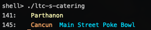

# LTC-S Catering

Want to know what's on the menu today at LTC South? Use this script to find out.



## Usage

```sh
./ltc-s-catering
```

## Requirements

Must have Python 3 installed as `python3`.

## Install Dependencies

```sh
pip3 install -r requirements.txt
```
